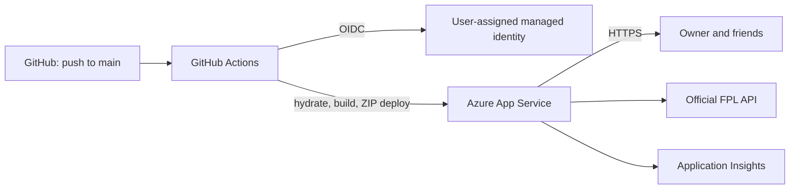

# Azure Deployment Plan

> **Status:** Executing

Generated: 2026-08-30

---

## 1. Project Overview

**Goal:** Host FPL Formula as a public, shareable Azure App Service web app and redeploy it automatically after every push to `main` (including pull-request merges).

**Path:** Modernize Existing

The repository is a Next.js 16 / React 19 SSR application. Its Node.js route handlers use the native `@duckdb/node-api` package and read hydrated Parquet data from `data/parquet/`, so it must run as a Node server rather than a static site.

---

## 2. Requirements

| Attribute | Value |
|-----------|-------|
| Classification | POC / personal shared dashboard |
| Scale | Small — the owner and a few friends |
| Budget | Cost-optimized within the requested always-on B1 Basic plan |
| Subscription | Dominic-Project (`122d6585-f980-4741-9c62-e432622d84dc`) — confirmed |
| Location | East Asia (`eastasia`) — confirmed |
| Compliance | No additional requirements |
| Deployment branch | `main` — confirmed (the repository has no `master` branch) |

### Policy Constraints

- The subscription has one enforced policy that blocks West Europe. East Asia is permitted.

---

## 3. Components Detected

| Component | Type | Technology | Path |
|-----------|------|------------|------|
| FPL Formula | SSR web app and API | Next.js 16, React 19, Node.js | `src/app` |
| Ranking data hydrator | Build-time data job | TypeScript, DuckDB, Parquet | `scripts/hydrate-fpl.ts` |

### Existing Infrastructure

| Item | Status |
|------|--------|
| Azure resource group | Created: `fpl-formula-rg` in East Asia |
| Azure configuration / IaC | Not present |
| Dockerfile | Not present |
| GitHub Actions workflows | Not present |
| Git remote | `https://github.com/dominic-lcw/fpl-formula.git` |

---

## 4. Recipe Selection

**Selected:** Bicep with Azure CLI

**Rationale:** The application needs an App Service configuration and a GitHub Actions deployment workflow tailored to its generated DuckDB/Parquet data. Bicep provides repeatable infrastructure while the workflow builds, hydrates, and deploys the server package directly to App Service without adding a container registry.

---

## 5. Architecture

**Stack:** App Service

### Service Mapping

| Component | Azure Service | SKU / configuration |
|-----------|---------------|---------------------|
| FPL Formula Node server | Linux Azure App Service | One B1 Basic instance, Node.js 20 LTS |
| App Service host plan | Azure App Service Plan | B1 Basic, Linux, always on |
| Application monitoring | Application Insights + Log Analytics workspace | Workspace-based, 30-day retention |
| Application identity | User-assigned managed identity | Attached to the web app; no data-plane roles are needed |
| GitHub Actions identity | User-assigned managed identity | Separate `azrg<token>` resource group; federated to GitHub environment `production` |

### Deployment Design

- Resource names use an `az` prefix and a deterministic deployment token; the public web app name is `azweb<token>`, which is globally unique to this subscription, region, and environment.
- The production workflow triggers on pushes to `main`; GitHub treats a merged pull request as a push to that branch.
- Every workflow run installs dependencies on an Ubuntu runner, executes `pnpm hydrate`, builds the Next.js standalone server, copies `data/parquet/` into the deployment package, then ZIP-deploys it.
- The App Service restarts for the new package, loading the fresh Parquet data into its in-memory DuckDB connection.
- A GitHub `production` environment will be used without required reviewers so deployment remains automatic.
- The workflow authenticates through GitHub OpenID Connect and a user-assigned managed identity; no Azure password or publish profile is stored in GitHub.

### Security Configuration

- HTTPS only; public access is required for sharing the dashboard.
- Managed identity authentication uses a federated credential limited to this repository and the `production` GitHub environment.
- The workflow identity receives scoped roles only: Contributor on `fpl-formula-rg` for the manually-run infrastructure workflow and Website Contributor on the web app for application deployments.
- No Key Vault is needed because this application has no deployment-time application secret.

---

## 6. Provisioning Limit Checklist

Azure Resource Graph reported zero existing resources in `fpl-formula-rg`. The Azure Quota CLI was tried after registering `Microsoft.Quota`, but the service still returned `MissingRegistrationForResourceProvider`; the documented App Service limits are therefore used as the supported fallback.

| Resource Type | Number to Deploy | Total After Deployment | Limit / Quota | Notes |
|---------------|------------------|------------------------|---------------|-------|
| `Microsoft.Web/serverfarms` (B1) | 1 | 1 | 100 plans per resource group | Current usage is 0; Microsoft App Service limits |
| `Microsoft.Web/sites` | 1 | 1 | Unlimited apps per Basic plan; ≤8 apps recommended for B1 | Current usage is 0; one app is planned |
| B1 instances | 1 | 1 | 3 maximum instances per plan | One instance is planned |
| `Microsoft.Insights/components` | 1 | 1 | No regional count quota published | Current usage is 0 |
| `Microsoft.OperationalInsights/workspaces` | 1 | 1 | No regional count quota published | Current usage is 0 |
| `Microsoft.ManagedIdentity/userAssignedIdentities` | 2 | 2 | No regional count quota published | One identity for the app and one in a separate CI/CD resource group |

**Status:** ✅ The planned one-instance B1 deployment is within the documented App Service limits. Regional allocation is finally verified by the Bicep what-if and deployment.

---

## 7. Execution Checklist

### Phase 1: Planning
- [x] Analyze workspace and scan components
- [x] Confirm subscription, region, branch, plan, and compliance requirements
- [x] Check subscription policy assignments
- [x] Validate capacity and resource inventory
- [x] Select Bicep / Azure CLI recipe and App Service architecture
- [x] User approved this plan

### Phase 2: Preparation
- [x] Add standalone Next.js build configuration and a 200-health endpoint
- [x] Create Bicep for App Service, monitoring, and the GitHub Actions managed identity
- [x] Create a production deployment workflow and a manually-run infrastructure workflow
- [x] Create `.azure/pipeline-setup.md` with the GitHub environment and Azure OIDC setup
- [x] Build, test, lint, and package the application locally
- [x] Run a Bicep what-if deployment
- [x] Update this plan to `Ready for Validation`

### Phase 3: Validation
- [x] Invoke Azure validation
- [x] Validate the Bicep and workflow files
- [x] Validate a production standalone package
- [x] Update this plan to `Validated`

### Phase 4: Deployment
- [x] Provision the App Service resources
- [x] Configure GitHub environment variables for the deployment identity and web app
- [ ] Deploy the first hydrated package
- [ ] Verify the public HTTPS URL and health endpoint
- [ ] Update this plan to `Deployed`

---

## 8. Files to Generate

| File | Purpose | Status |
|------|---------|--------|
| `.azure/deployment-plan.md` | Deployment source of truth | ✅ |
| `.azure/pipeline-setup.md` | Manual GitHub environment and OIDC setup instructions | ✅ |
| `infra/main.bicep` | Repeatable App Service, monitoring, and CI/CD identity infrastructure | ✅ |
| `infra/main.parameters.json` | Non-secret infrastructure parameters | ✅ |
| `.github/workflows/provision.yml` | Manually-run infrastructure deployment | ✅ |
| `.github/workflows/deploy.yml` | Build, hydrate, test, and deploy on pushes to `main` | ✅ |

---

## 9. Role Assignment Verification

- **Application identity:** attached to the App Service as required; the application makes no Azure data-plane calls, so it needs no role assignment.
- **GitHub Actions identity:** Contributor on `fpl-formula-rg` for the manual infrastructure workflow and Website Contributor on the specific web app for package deployment.
- **Result:** Verified. No application data-plane permissions are required and the deployment identity is scoped to its deployment duties.

---

## 10. Validation Proof

| Check | Command Run | Result | Timestamp |
|-------|-------------|--------|-----------|
| Application tests | `pnpm test` | ✅ 3 files, 6 tests passed | 2026-08-30 |
| Application lint | `pnpm lint` | ✅ Passed | 2026-08-30 |
| Next.js production build | `pnpm build` | ✅ Passed; standalone output and `/api/health` route generated | 2026-08-30 |
| Bicep compilation and lint | `az bicep build --file infra/main.bicep --stdout` and `az bicep lint --file infra/main.bicep` | ✅ Passed; Azure's newest API types emitted non-blocking `BCP081` warnings | 2026-08-30 |
| Template validation | `az deployment sub validate --location eastasia --template-file infra/main.bicep --parameters @infra/main.parameters.json` | ✅ Succeeded | 2026-08-30 |
| Infrastructure preview | `az deployment sub what-if --name fpl-formula-infrastructure --location eastasia --template-file infra/main.bicep --parameters @infra/main.parameters.json` | ✅ Succeeded; only planned resources will be created | 2026-08-30 |
| Azure authentication | `az account show` | ✅ Dominic-Project subscription enabled | 2026-08-30 |
| Azure Policy | `policy_assignment_list` | ✅ East Asia allowed; only West Europe is blocked | 2026-08-30 |

**Validated by:** azure-validate workflow

---

## 11. Next Steps

**Current:** Provision the validated infrastructure, configure GitHub, and deploy the first release.

**Current:** Commit and push the generated workflow files to `main`; the deployment workflow will then build the Linux package, hydrate FPL data, and deploy the first release.
